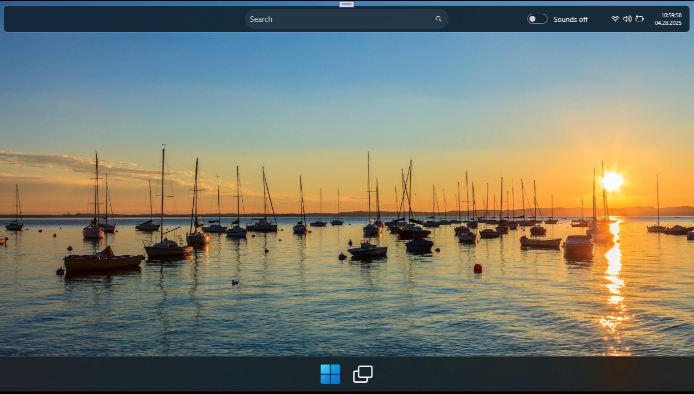
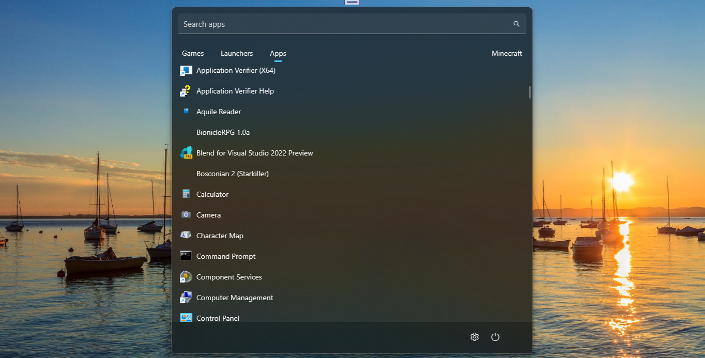

# WMR 1.0.0-alpha 

## About
Fullscreen application that mimics Windows10Mobile desktop with some user-friendly UI named... "WMR" :)

## Screenshots

## Tech. details
- I hope it compatible with Windows 11 Tiny (some os mods, with many, many cutted things)
- Target Framework: .NET 8.0
- Used workbench: Visual Studio 2022 Preview with all updates (2025)
- Target OS version: 10.0.19041.0 (so, win 10 is good choice!)
- Minimal supported OS version: 10.0.17763.0 (hello, old sweet Win10-based poor notebooks))))

## My 2 cents
- I tested this fine project. Ok, it's compiled (builded) ok, and it does work! ))))

## Features
🟡 Start menu

🟡 Taskbar

## ToDo
❌ Menu bar

❌ Task view

## Installation
I have not created any installer. So, you can clone the repo and build it yourself... :)

## References
- Sorry, I can't remember who is initial author of this code :) Initial repo name was… windows-mobile... and that's all! ))) 

## .
As is. No support. DIY. Learn purposes only. Just for fun!

## ..
[m][e] 2025
